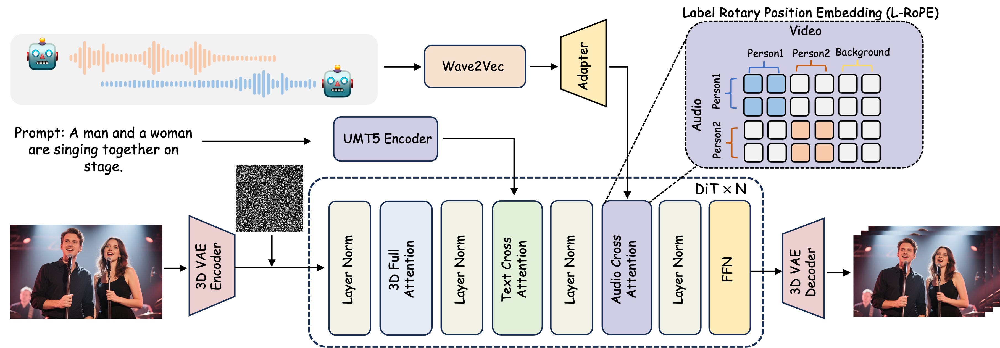
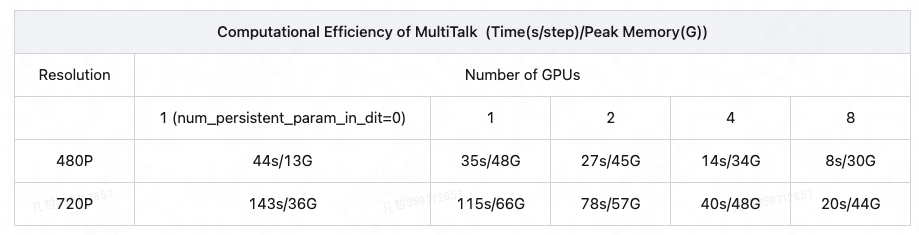

<div align="center">

<p align="center">
  
</p>

<h1>Let Them Talk: Audio-Driven Multi-Person Conversational Video Generation</h1>


[Zhe Kong*](https://scholar.google.com/citations?user=4X3yLwsAAAAJ&hl=zh-CN) · [Feng Gao*](https://scholar.google.com/citations?user=lFkCeoYAAAAJ) ·[Yong Zhang](https://yzhang2016.github.io/)<sup>&#9993;</sup> · [Zhuoliang Kang](https://scholar.google.com/citations?user=W1ZXjMkAAAAJ&hl=en) · [Xiaoming Wei](https://scholar.google.com/citations?user=JXV5yrZxj5MC&hl=zh-CN) · [Xunliang Cai](https://openreview.net/profile?id=~Xunliang_Cai1)  

[Guanying Chen](https://guanyingc.github.io/) · [Wenhan Luo](https://whluo.github.io/)<sup>&#9993;</sup>

<sup>*</sup>Equal Contribution
<sup>&#9993;</sup>Corresponding Authors


<a href='https://meigen-ai.github.io/multi-talk/'></a>
<a href='https://arxiv.org/abs/2505.22647'></a>
<a href='https://huggingface.co/MeiGen-AI/MeiGen-MultiTalk'></a>
</div>

> **TL; DR:**  MultiTalk is an audio-driven multi-person conversational video generation​​. It enables the video creation of multi-person conversation 💬, singing  🎤,  interaction control 👬, and cartoon 🙊.

<p align="center">
  
</p>

## Video Demos

<table border="0" style="width: 100%; text-align: left; margin-top: 20px;">
  <tr>
      <td>
          <video src="https://github.com/user-attachments/assets/e55952e6-e1b2-44a5-9887-a89307a378da" width="320" controls loop></video>
      </td>
      <td>
          <video src="https://github.com/user-attachments/assets/f0396c19-d459-42aa-9d78-34fdea10de18" width="320" controls loop></video>
      </td>
       <td>
          <video src="https://github.com/user-attachments/assets/3576fd04-3e5f-4933-ac7b-1c4e6a601379" width="320" controls loop></video>
     </td>
  </tr>
  <tr>
      <td>
          <video src="https://github.com/user-attachments/assets/5589056e-3202-442d-a62a-2cad7a7ecb19" width="320" controls loop></video>
      </td>
      <td>
          <video src="https://github.com/user-attachments/assets/554bfbe7-0090-492c-94be-329f5e39e175" width="320" controls loop></video>
      </td>
       <td>
          <video src="https://github.com/user-attachments/assets/9e961f35-9413-4846-a806-8186d54061da" width="320" controls loop></video>
     </td>
  </tr>
  <tr>
      <td>
          <video src="https://github.com/user-attachments/assets/342595ab-cf75-4872-8182-f20fe8c95611" width="320" controls loop></video>
      </td>
      <td>
          <video src="https://github.com/user-attachments/assets/6476f9f0-35e0-4484-91a4-8aa646aa994a" width="320" controls loop></video>
      </td>
       <td>
          <video src="https://github.com/user-attachments/assets/d8fc8e94-0cba-4c25-9f3a-a8d7e0a785e1" width="320" controls loop></video>
     </td>
  </tr>
</table>


## ✨ Key Features

We propose **MultiTalk** , a novel framework for audio-driven multi-person conversational video generation. Given a multi-stream audio input, a reference image and a prompt, MultiTalk generates a video containing interactions following the prompt, with consistent lip motions aligned with the audio.

> - 💬 **​​Realistic Conversations**​​ - Support single & multi-person generation
> - 👥 ​​**​​Interactive Character Control**​​​​ - Direct virtual humans via prompts
> - 🎤 ​​**​​Generalization Performances**​​​​ - Support the generation of cartoon character and singing 
> - 📺 **​​​​Resolution Flexibility​​**​​: 480p & 720p output at arbitrary aspect ratios
> - ⏱️ **Long Video Generation**: Support video generation up to 15 seconds

## 🔥 Latest News

* June 14, 2025: 🔥🔥 We release `MultiTalk` with support for `multi-GPU inference`, `teacache acceleration`, `APG` and `low-VRAM inference` (enabling 480P video generation on a single RTX 4090). [APG](https://arxiv.org/abs/2410.02416) is used to alleviate the color error accumulation in long video generation. TeaCache is capable of increasing speed by approximately 2~3x.
* June 9, 2025: 🔥🔥 We release the [weights](https://huggingface.co/MeiGen-AI/MeiGen-MultiTalk) and inference code of **MultiTalk** 
* May 29, 2025: We release the [Technique-Report](https://arxiv.org/abs/2505.22647) of **MultiTalk** 
* May 29, 2025: We release the [project page](https://meigen-ai.github.io/multi-talk/) of **MultiTalk** 

## 🌐 Community  Works
- [ComfyUI](https://github.com/kijai/ComfyUI-WanVideoWrapper/tree/multitalk): thanks [kijai](https://github.com/kijai) for integrating MultiTalk into ComfyUI-WanVideoWrapper. [Rudra](https://github.com/Rudra-ai-coder) found something interesting that MultiTalk can be combined with Wanx T2V and VACE in the [issue](https://github.com/kijai/ComfyUI-WanVideoWrapper/issues/635). 
- [Google Colab example](https://colab.research.google.com/drive/185OyRIpJDlpnRjhBRb7FnaRlq11BLZTa?usp=sharing), an exmaple for inference on A100 provided by [Braffolk](https://github.com/Braffolk).

## 📑 Todo List

- [x] Release the technical report
- [x] Inference
- [x] Checkpoints
- [x] Multi-GPU Inference
- [ ] Inference acceleration
  - [x] TeaCache
  - [ ] int8 quantization
  - [ ] LCM distillation
  - [ ] Sparse Attention
- [x] Run with very low VRAM
- [ ] TTS integration
- [ ] Gradio demo
- [ ] ComfyUI
- [ ] 1.3B model

## Quick Start

### 🛠️Installation

#### 1. Create a conda environment and install pytorch, xformers
```
conda create -n multitalk python=3.10
conda activate multitalk
pip install torch==2.4.1 torchvision==0.19.1 torchaudio==2.4.1 --index-url https://download.pytorch.org/whl/cu121
pip install -U xformers==0.0.28 --index-url https://download.pytorch.org/whl/cu121
```
#### 2. Flash-attn installation:
```
pip install ninja 
pip install psutil 
pip install packaging 
pip install flash_attn
```

#### 3. Other dependencies
```
pip install -r requirements.txt
conda install -c conda-forge librosa
```

#### 4. FFmeg installation
```
conda install -c conda-forge ffmpeg
```
or
```
sudo yum install ffmpeg ffmpeg-devel
```

### 🧱Model Preparation

#### 1. Model Download

| Models        |                       Download Link                                           |    Notes                      |
| --------------|-------------------------------------------------------------------------------|-------------------------------|
| Wan2.1-I2V-14B-480P  |      🤗 [Huggingface](https://huggingface.co/Wan-AI/Wan2.1-I2V-14B-480P)       | Base model
| chinese-wav2vec2-base |      🤗 [Huggingface](https://huggingface.co/TencentGameMate/chinese-wav2vec2-base)          | Audio encoder
| MeiGen-MultiTalk      |      🤗 [Huggingface](https://huggingface.co/MeiGen-AI/MeiGen-MultiTalk)              | Our audio condition weights

Download models using huggingface-cli:
``` sh
huggingface-cli download Wan-AI/Wan2.1-I2V-14B-480P --local-dir ./weights/Wan2.1-I2V-14B-480P
huggingface-cli download TencentGameMate/chinese-wav2vec2-base --local-dir ./weights/chinese-wav2vec2-base
huggingface-cli download TencentGameMate/chinese-wav2vec2-base model.safetensors --revision refs/pr/1 --local-dir ./weights/chinese-wav2vec2-base
huggingface-cli download MeiGen-AI/MeiGen-MultiTalk --local-dir ./weights/MeiGen-MultiTalk
```

#### 2. Link or Copy MultiTalk Model to Wan2.1-I2V-14B-480P Directory

Link through:
```
mv weights/Wan2.1-I2V-14B-480P/diffusion_pytorch_model.safetensors.index.json weights/Wan2.1-I2V-14B-480P/diffusion_pytorch_model.safetensors.index.json_old
sudo ln -s {Absolute path}/weights/MeiGen-MultiTalk/diffusion_pytorch_model.safetensors.index.json weights/Wan2.1-I2V-14B-480P/
sudo ln -s {Absolute path}/weights/MeiGen-MultiTalk/multitalk.safetensors weights/Wan2.1-I2V-14B-480P/
```

Or, copy through:
```
mv weights/Wan2.1-I2V-14B-480P/diffusion_pytorch_model.safetensors.index.json weights/Wan2.1-I2V-14B-480P/diffusion_pytorch_model.safetensors.index.json_old
cp weights/MeiGen-MultiTalk/diffusion_pytorch_model.safetensors.index.json weights/Wan2.1-I2V-14B-480P/
cp weights/MeiGen-MultiTalk/multitalk.safetensors weights/Wan2.1-I2V-14B-480P/
```
### 🔑 Quick Inference

Our model is compatible with both 480P and 720P resolutions. The current code only supports 480P inference. 720P inference requires multiple GPUs, and we will provide an update soon.
> Some tips
> - Lip synchronization accuracy:​​ Audio CFG works optimally between 3–5. Increase the audio CFG value for better synchronization.
> - ​​Video clip length:​​ The model was trained on 81-frame videos at 25 FPS. For optimal prompt following performance, generate clips at 81 frames. Generating up to 201 frames is possible, though longer clips might reduce prompt-following performance.
> - ​​Long video generation:​​ Audio CFG influences color tone consistency across segments. Set this value to 3 to alleviate tonal variations.
> - Sampling steps: If you want to generate a video fast, you can decrease the sampling steps to even 10 that will not hurt the lip synchronization accuracy, but affects the motion and visual quality. More sampling steps, better video quality.
> - TeaCache accelerate:​​ The optimal range for `--teacache_thresh` is between 0.2 and 0.5. Increasing this value can further improve acceleration, but may also lead to a decline in the quality of the generated video.

#### Usage of MultiTalk
```
--mode streaming: long video generation.
--mode clip: generate short video with one chunk. 
--use_teacache: run with TeaCache.
--size multitalk-480: generate 480P video.
--size multitalk-720: generate 720P video.
--use_apg: run with APG.
--teacache_thresh: A coefficient used for TeaCache acceleration
```

#### 1. Single-Person

##### 1) Run with single GPU


```
python generate_multitalk.py \
    --ckpt_dir weights/Wan2.1-I2V-14B-480P \
    --wav2vec_dir 'weights/chinese-wav2vec2-base' \
    --input_json examples/single_example_1.json \
    --sample_steps 40 \
    --mode streaming \
    --use_teacache \
    --save_file single_long_exp

```

##### 2) Run with very low VRAM

If you want run with very low VRAM, set `--num_persistent_param_in_dit 0`:


```
python generate_multitalk.py \
    --ckpt_dir weights/Wan2.1-I2V-14B-480P \
    --wav2vec_dir 'weights/chinese-wav2vec2-base' \
    --input_json examples/single_example_1.json \
    --sample_steps 40 \
    --mode streaming \
    --num_persistent_param_in_dit 0 \
    --use_teacache \
    --save_file single_long_lowvram_exp

```

##### 3) Multi-GPU inference

```
GPU_NUM=8
torchrun --nproc_per_node=$GPU_NUM --standalone generate_multitalk.py \
    --ckpt_dir weights/Wan2.1-I2V-14B-480P \
    --wav2vec_dir 'weights/chinese-wav2vec2-base' \
    --dit_fsdp --t5_fsdp \
    --ulysses_size=$GPU_NUM \
    --input_json examples/single_example_1.json \
    --sample_steps 40 \
    --mode streaming \
    --use_teacache \
    --save_file single_long_multigpu_exp

```


#### 2. Multi-Person

##### 1) Run with single GPU

```
python generate_multitalk.py \
    --ckpt_dir weights/Wan2.1-I2V-14B-480P \
    --wav2vec_dir 'weights/chinese-wav2vec2-base' \
    --input_json examples/multitalk_example_2.json \
    --sample_steps 40 \
    --mode streaming \
    --use_teacache \
    --save_file multi_long_exp
```
##### 2) Run with very low VRAM


```
python generate_multitalk.py \
    --ckpt_dir weights/Wan2.1-I2V-14B-480P \
    --wav2vec_dir 'weights/chinese-wav2vec2-base' \
    --input_json examples/multitalk_example_2.json \
    --sample_steps 40 \
    --mode streaming \
    --num_persistent_param_in_dit 0 \
    --use_teacache \
    --save_file multi_long_lowvram_exp

```

##### 3) Multi-GPU inference

```
GPU_NUM=8
torchrun --nproc_per_node=$GPU_NUM --standalone generate_multitalk.py \
    --ckpt_dir weights/Wan2.1-I2V-14B-480P \
    --wav2vec_dir 'weights/chinese-wav2vec2-base' \
    --dit_fsdp --t5_fsdp --ulysses_size=$GPU_NUM \
    --input_json examples/multitalk_example_2.json \
    --sample_steps 40 \
    --mode streaming --use_teacache \
    --save_file multi_long_multigpu_exp

```

## 🚀Computational Efficiency
The results are evaluated on A100 GPUs for multi-person generation. Single-person generation uses less memory and provides faster inference.
<p align="center">
  
</p>
TeaCache is capable of increasing speed by approximately 2~3x.


## 📚 Citation

If you find our work useful in your research, please consider citing:

```
@article{kong2025let,
  title={Let Them Talk: Audio-Driven Multi-Person Conversational Video Generation},
  author={Kong, Zhe and Gao, Feng and Zhang, Yong and Kang, Zhuoliang and Wei, Xiaoming and Cai, Xunliang and Chen, Guanying and Luo, Wenhan},
  journal={arXiv preprint arXiv:2505.22647},
  year={2025}
}
```

## 📜 License
The models in this repository are licensed under the Apache 2.0 License. We claim no rights over the your generated contents, 
granting you the freedom to use them while ensuring that your usage complies with the provisions of this license. 
You are fully accountable for your use of the models, which must not involve sharing any content that violates applicable laws, 
causes harm to individuals or groups, disseminates personal information intended for harm, spreads misinformation, or targets vulnerable populations. 

